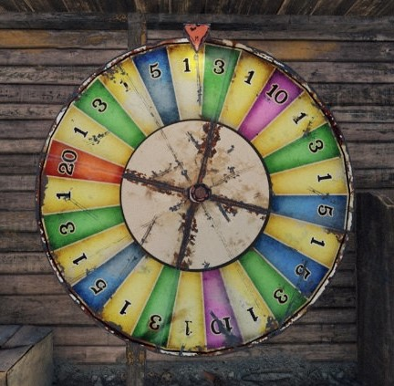

# Rust Wheel Sim

Simulates the Rust roulette wheel with priori statistics

## Operation

(assuming your local environment has [yarn](https://yarnpkg.com/))

1. `git clone https://github.com/jacob-alford/rust-wheel-sim.git`
1. `yarn && yarn start`

## FP Modules

1. `Bet.ts`
1. `DiscreteDistribution.ts`
1. `Fraction.ts`
1. `Probability.ts`
1. `Strategy.ts`
